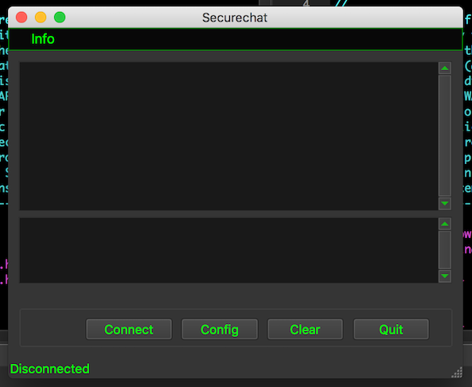
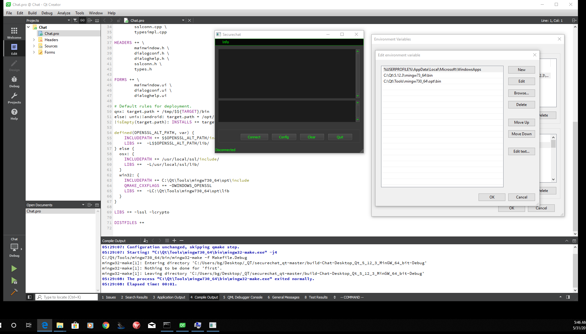

Description:
============

Securechat is a QT based client/server chat utility  using  ssl/tls (openssl) to establish an encrypted communication between the two parties. This program is a porting of my chat program securechat from ncurses to QT.  

This program is fully interoperable with its ncurses counterpart. 

The ncurses version is also available in my github site.

images qtchat1.png

Dependencies:
-------------

- SSL 1.0 (will be upgraded asap)  
- QT5  

Tested on:
----------

- OSX 10.13.6
- Ubuntu 18 LTS

Tested on:
----------

- OSX 10.13.6
- Ubuntu 18.04.2 LTS
- Windows 10 ((build 17134)

Dependencies intallation (Ubuntu example):
------------------------------------------

* sudo apt install libssl1.0-dev 
 
* apt-get install qt5-default 

Build:
------

* From the source directory:

   qmake 
   make 

Server Certificates Configuration:
==================================

1. Create Certification Authority: 
$ mkdir $HOME/.securechat  
$ cd $HOME/.securechat  
$ openssl req -out ca.pem -new -x509 

2. Server Private Key: 
$ openssl genrsa -out server.key 4096 

3. Certificate Request: 
$ openssl req -key server.key -new -out server.req 

4. Certificate Sequence (a progressive number):  
$ echo "11" > file.seq 

5. Public Key: 
$ openssl x509 -req -in server.req -CA ca.pem -CAkey privkey.pem -CAserial file.seq -out server.pem

5. Only the owner of the server.key and the other private archives can be able to read or modify those files, check the permissions and change it in case of wrong privileges! 
$ chmod -R 600 *  

* Note: This program support the certificate passphrase, if it is used on a shared computer, it is strongly recommended to use this feature. 

Client Certificates Configuration:
==================================

Request the server.pem certificate to the server counterpart and insert that file in: 
$HOME/.securechat/TrustStore.pem  

Windows Version:
================

I'm working to an experimental Windows version that is included in the distribution. 
It was produced from the Linux/OSX version with minimum changes. 
It requires QT and Mingw on Windows: 

Dependencies (current testing environment):
============================================

- Upgraded Windows 10;
- 5_12_2_
- Mingw

Window Environment:
==================

After compiling the source code, it's required to add these paths to the PATH variable: 

C:\Qt\5.12.3\mingw73_64\bin;C:\Qt\Tools\mingw730_64\opt\bin;

 The procedure to create openssl certificates is the same, but , the target directory is:  

C:\securechat
